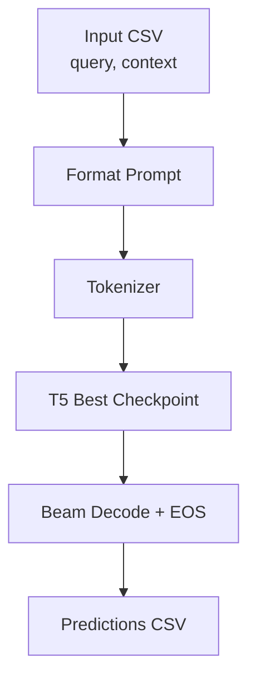
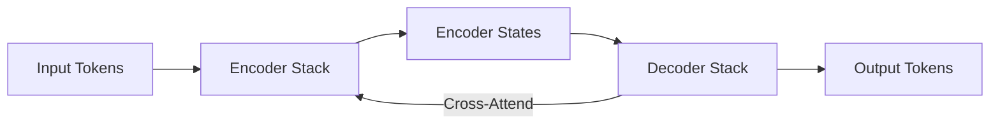
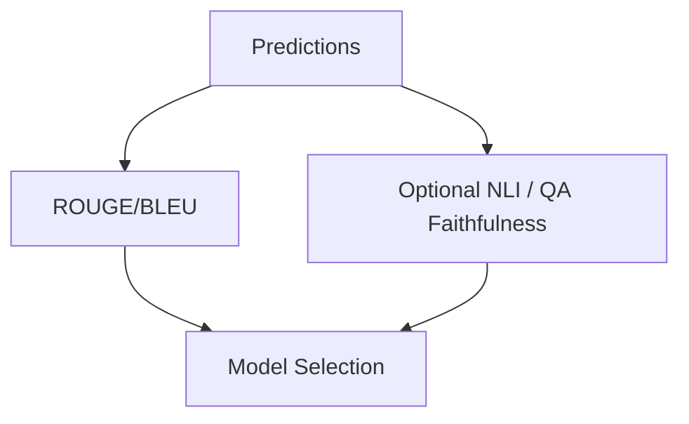

# Diagrams

All diagrams are Mermaid to render on GitHub.

## 1) Data Pipeline (Raw → Clean)
```mermaid
flowchart TD
  A[Raw CSV\n(data/input_datasets/training_data.csv)] --> B[ETL\nprocess_data_sft_clean.py]
  B --> C[Filtered + Oracle Targets\ntraining_data_sft_clean_end.csv]
  C --> D[Train/Val/Test Split]
  D --> E[Tokenization]
```

## 2) Training Loop (SFT)
```mermaid
flowchart TD
  A[Tokenized Train/Val] --> B[T5 Encoder-Decoder]
  B --> C[Cross-Entropy Loss]
  C --> D[Optimizer Step]
  D --> E[Eval (ROUGE/BLEU)]
  E --> F{Early Stop?\n(metric=ROUGE-L)}
  F -- no --> B
  F -- yes --> G[Save Best Checkpoint]
```

## 3) Inference Flow (Best Checkpoint)


## 4) Model Architecture (T5)


## 5) Evaluation & Selection

